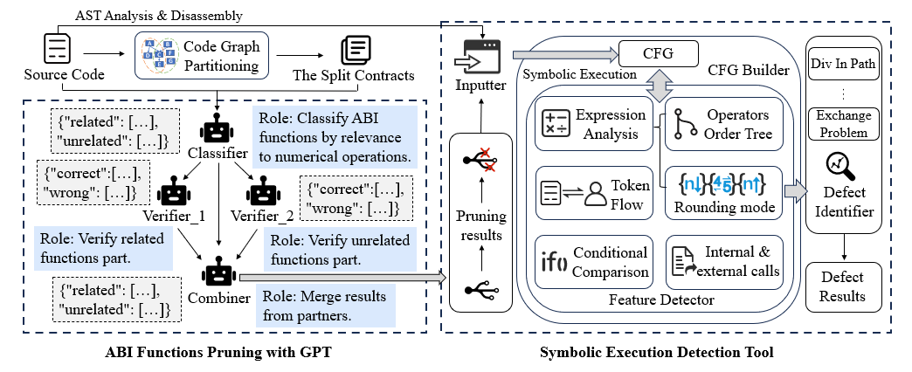

# NumScout

## Description

A static analysis tool for detecting new types of numerical contract defects based on a symbolic execution framework.

## Features

- Specializing on 5 new types of numerical defects
  - *Div In Path*
  - *Operator Order Issue*
  - *Minor Amount Retention*
  - *Exchange Problem*
  - *Precision Loss Trend*
- NumScout is also extensible to all Solidity versions of smart contracts.
- NumScout found 1,774 smart contracts containing at least one of the 5 defects in 6,617 contracts from Etherscan.
  The related dataset can be found at [Experiment](./Experiment/).

## Code Structure

The design refers to the architecture shown below:



- `inputter`: **_Inputter_** module for compiling the source code of Solidity smart contracts and extracting useful information for further analysis before symbolic execution.
- `cfg_builder`: **_CFG Builder_** module for analysis, including essential data structures, and symbolic execution of evm opcodes.
- `feature_detector`: **_Feature Detector_** module of core analysis of finding numerical defects during execution based on 4 operational features (i.e., expression information, conditional comparisons, token flows, and internal&external function calls) and detection rules.
- `defect_identifier`: **_Defect Identifier_** module of definition of classes of defect types, and reporter to show the detection results.
- `test`: test demo for running NumScout.
- `global_params.py`: global params for analysis.
- `tool.py`: interfaces for input and output.
- `requirements.txt`: required packages for running tool.

## Usage

1. Prepare requirements.

- Python environment: please use Python 3.8, which is recommended (tested).

- Python dependencies: please use pip to install dependencies in `requirements.txt`.

  ```shell
    $ pip3 install -r requirements.txt
  ```

- `solc`: please use solc-select which is downloaded in dependencies to install all versions of Solidity and switch to it. e.g. 

  ```shell
    $ solc-select install 0.8.16
    $ solc-select use 0.8.16
  ```

- `evm`: please download version 1.10.21 (tested) from [go-ethereum](https://geth.ethereum.org/downloads) and add executable bins in the `$PATH`. Ubuntu users can also use PPA:

  ```shell
  $ sudo apt-get install software-properties-common
  $ sudo add-apt-repository -y ppa:ethereum/ethereum
  $ sudo apt-get update
  $ sudo apt-get install ethereum
  ```

1. Demo test:

   ```shell
   $ python3 tool.py -s test/demo.sol -cnames token -j -sv "solc-version" [-pf "pruning-file"]
   ```

   It would take minutes to show the result in the console, and there will be a json file to store the results in the same directory of the tested contract.
